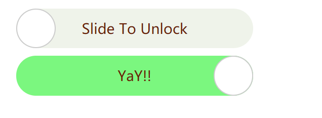

# SlideToUnlock/Lock Jquery Plugin

Check [demo](http://wesamgerges.com/slidetounlock/)

### Usage
```
    <link href="css/slideToUnlock.css" rel="stylesheet">  
    <link href="css/green.theme.css" rel="stylesheet">  
    <script src="jquery.slideToUnlock.js"></script>  
```
```
    $("div").slideToUnlock();
```
### Options
* lockText: A string Change the default text
        default: Slide To Unlock
* unlockText: A string Change the default text
        default: Slide To Unlock       
* useData : Boolean. Weather to use the data attribute
        in the element to get the text and status
* status: A boolean indeactes weather the inital state
        is locked or unlocked.
* unlockfn: A call back function fired when the item is unlocked.
        the `this` variable is passed by default as `self`.
* lockfn: A call back function fired when the item is locked.       
        the `this` variable is passed by default as `self`.
* allowToLock: a boolean value indecates if the 
                can lock back or not.
        default: true      

```
    $("div").slideToUnlock({
        lockText: "Hello World!",
        allowToLock: true 
    });
```
## Themes

### Green Theme

```
.locked {
    color: #692003;
    font-size: 18px;
    font-family: 'Microsoft Yahei', serif;      
    background-color: #eff3ea;   
}
.unlocked {
    background-color:rgba(8, 252, 20, 0.5);
}
```

### iPhone Theme

```
.locked {
    font-size: 18px;
    font-family: 'Microsoft Yahei', serif;      
    background-color: rgb(168, 167, 167);   
    color: white;
}
.locked_handle{
    background-image: url("../img/right_arrow.png");  
}  
.unlocked {
    background-color:rgb(128, 131, 128);
}
.unlocked_handle{
    background-image: url("../img/left_arrow.png");   
}  
```

With themes, you can easily change:

* backgroud color
* background image.
* using gradiant you can do a lot.
* font color
* font family
* font size
* font weight

Adding contents to the handle
```
.unlocked {
    background-color:rgb(128, 131, 128);
}
```

### How to add you own theme
Just define those 2 css classes
* `.locked`
* `.unlocked`

Two other optional classes if you want the handle to 
appear differently.

* `.locked_handle`
* `.unlocked_handle`

### Note
Unlock state ==  to success state.

### Features
* Ability to lock and unlock
* change theme.
* change width and height.
* Works with touch as well as mouse.
* Supported by most modern browsers.
* All built with ES6 standards.
* Callback functions accepts this as parameter


### Prerequisites
Jquery library

[demo](http://wesamgerges.com/slidetounlock/)
